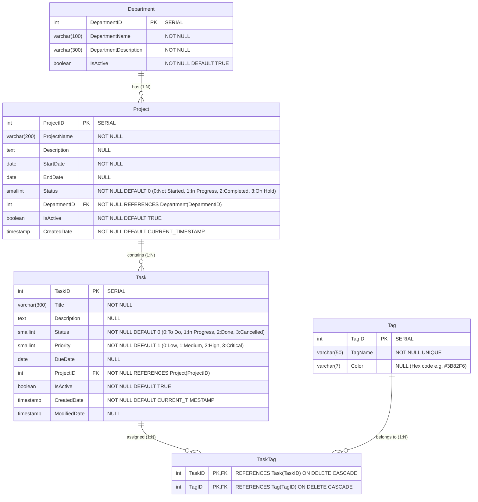

# TaskTrack — Task & Team Management System

[](https://github.com/TomOutfit/Assignment-1_PRN232_Fa26/actions/workflows/ci.yml)
[](https://dotnet.microsoft.com/)
[](https://react.dev/)
[](https://www.typescriptlang.org/)
[](https://www.postgresql.org/)
[](https://vitejs.dev/)
[](https://render.com/)
[](https://vercel.com/)

> **PRN232 — Advanced Cross-Platform Application Programming with .NET (Assignment 1)**  
> **Student ID**: `QE190061` | **Author**: `TomOutfit`

---

## 🌐 Live Production Links

| Resource | URL | Description |
| :--- | :--- | :--- |
| 🚀 **Web Application (Frontend)** | [https://qe190061-prn232-ass1-fe.vercel.app](https://qe190061-prn232-ass1-fe.vercel.app) | Responsive React 19 SPA deployed on Vercel |
| ⚡ **RESTful API Service** | [https://qe190061-prn232-ass1-be.onrender.com](https://qe190061-prn232-ass1-be.onrender.com) | ASP.NET Core 10 Web API hosted on Render Docker container |
| 📖 **Swagger / OpenAPI UI** | [https://qe190061-prn232-ass1-be.onrender.com/swagger](https://qe190061-prn232-ass1-be.onrender.com/swagger) | Interactive API exploration and testing interface |
| 🐙 **Source Code (GitHub)** | [https://github.com/TomOutfit/Assignment-1_PRN232_Fa26](https://github.com/TomOutfit/Assignment-1_PRN232_Fa26) | Full-stack monorepo with CI/CD workflows |

---

## 📌 Project Overview

**TaskTrack** is a cross-platform Task & Team Management application designed to streamline project workflows, track task statuses, organize departmental workloads, and categorize activities using dynamic tags.

Built following standard enterprise engineering standards:
- **Backend**: Strict **3-Tier Layered Architecture** (`API` ➔ `Service` ➔ `Repo`) using **ASP.NET Core 10** and **Entity Framework Core 10** with Database-First scaffolding on **PostgreSQL**.
- **Frontend**: Component-driven SPA built with **React 19**, **TypeScript**, **Vite**, **Vanilla CSS Design System (Glassmorphism & Dark/Light modes)**, and **Axios**.
- **DevOps**: Fully automated **GitHub Actions CI**, containerized with **Docker**, deployed on **Render** (API + Managed PostgreSQL) and **Vercel** (SPA Edge Hosting).

---

## 📊 Database Schema & Entity-Relationship Diagram (ERD)

The database follows a normalized relational structure created from [`TaskManagementDB_Postgres (1).sql`](./TaskManagementDB_Postgres%20(1).sql):



### 📋 Data Dictionary & Enums

#### 1. Status & Priority Enums
| Enum Name | Code | Name / Value | Description |
| :--- | :---: | :--- | :--- |
| **Project Status** | `0` | **Not Started** | Project planned but work hasn't begun |
| | `1` | **In Progress** | Project currently active and underway |
| | `2` | **Completed** | Project finished and delivered |
| | `3` | **On Hold** | Project temporarily paused |
| **Task Status** | `0` | **To Do** | Task pending execution |
| | `1` | **In Progress** | Task currently being worked on |
| | `2` | **Done** | Task completed successfully |
| | `3` | **Cancelled** | Task aborted or no longer required |
| **Task Priority** | `0` | **Low** | Routine tasks with flexible delivery |
| | `1` | **Medium** | Standard priority (default) |
| | `2` | **High** | Important tasks requiring prompt attention |
| | `3` | **Critical** | Urgent blockers requiring immediate action |

#### 2. Business Integrity & Constraints
- **Soft Deletion for Tasks**: When a task is deleted, `IsActive` is set to `FALSE` (never physical row deletion).
- **Referential Integrity for Projects**: A project cannot be deleted if it contains linked tasks (returns `HTTP 400 Bad Request`).
- **Referential Integrity for Departments**: A department cannot be deleted if linked to existing projects (returns `HTTP 400 Bad Request`).
- **Referential Integrity for Tags**: A tag cannot be deleted if assigned to any existing tasks (returns `HTTP 400 Bad Request`).
- **Unique Tag Names**: Duplicate tag names are prevented at database constraint level.

---

## 🏛️ System Architecture

```
                    ┌──────────────────────────────────────────────┐
                    │               React 19 Frontend              │
                    │      (Vite + TypeScript + Design Tokens)     │
                    └──────────────────────┬───────────────────────┘
                                           │ HTTPS (Axios / JSON)
                                           ▼
┌──────────────────────────────────────────────────────────────────────────────────┐
│                             TaskTrack.API (Presentation)                         │
│   • Controllers: TasksController, ProjectsController, DepartmentsController, ... │
│   • Program.cs, CORS Middleware, Swagger/OpenAPI, Dependency Injection           │
└──────────────────────────────────────────┬───────────────────────────────────────┘
                                           │
                                           ▼
┌──────────────────────────────────────────────────────────────────────────────────┐
│                            TaskTrack.Service (Business Logic)                    │
│   • Services: TaskService, ProjectService, DepartmentService, TagService         │
│   • DTOs, Business Validations, Constraint Verification, Mapping                 │
└──────────────────────────────────────────┬───────────────────────────────────────┘
                                           │
                                           ▼
┌──────────────────────────────────────────────────────────────────────────────────┐
│                           TaskTrack.Repo (Data Access)                           │
│   • Repositories: TaskRepo, ProjectRepo, DepartmentRepo, TagRepo                 │
│   • TaskTrackDbContext, EF Core 10 Entities (DB-First Scaffolding)               │
└──────────────────────────────────────────┬───────────────────────────────────────┘
                                           │ Npgsql Provider
                                           ▼
                    ┌──────────────────────────────────────────────┐
                    │              PostgreSQL Database             │
                    │   (Tables, Foreign Keys, Indexes, Cascades)  │
                    └──────────────────────────────────────────────┘
```

---

## 🔌 Complete RESTful API Reference

All endpoints return standard JSON envelopes and adhere to REST conventions:

### 1. Tasks API (`/api/Tasks`)
| Method | Endpoint | Description | Query / Body Params | Response |
| :--- | :--- | :--- | :--- | :---: |
| `GET` | `/api/Tasks` | Get all active tasks | — | `200 OK` |
| `GET` | `/api/Tasks/search` | Multi-criteria task search | `title`, `status`, `priority`, `projectId`, `tagId` | `200 OK` |
| `GET` | `/api/Tasks/{id}` | Get task details by ID (including assigned tags) | `{id}` (route) | `200 OK` / `404` |
| `GET` | `/api/Tasks/project/{projectId}` | Get all tasks belonging to a specific project | `{projectId}` (route) | `200 OK` |
| `POST` | `/api/Tasks` | Create a new task with optional tag IDs | `CreateTaskDto` | `201 Created` / `400` |
| `PUT` | `/api/Tasks/{id}` | Update task details and replace tag associations | `UpdateTaskDto` | `200 OK` / `400` / `404` |
| `DELETE` | `/api/Tasks/{id}` | Soft-delete a task (`IsActive = false`) | `{id}` (route) | `204 No Content` / `404` |

### 2. Projects API (`/api/Projects`)
| Method | Endpoint | Description | Query / Body Params | Response |
| :--- | :--- | :--- | :--- | :---: |
| `GET` | `/api/Projects` | Get all active projects with department info | — | `200 OK` |
| `GET` | `/api/Projects/search` | Filter projects by name, status, or department | `name`, `status`, `departmentId` | `200 OK` |
| `GET` | `/api/Projects/{id}` | Get project details and all associated tasks | `{id}` (route) | `200 OK` / `404` |
| `GET` | `/api/Projects/department/{deptId}` | Get all projects in a department | `{deptId}` (route) | `200 OK` |
| `POST` | `/api/Projects` | Create a new project | `CreateProjectDto` | `201 Created` / `400` |
| `PUT` | `/api/Projects/{id}` | Update project info | `UpdateProjectDto` | `200 OK` / `400` / `404` |
| `DELETE` | `/api/Projects/{id}` | Delete project (allowed only if 0 tasks linked) | `{id}` (route) | `204 No Content` / `400` / `404` |

### 3. Departments API (`/api/Departments`)
| Method | Endpoint | Description | Query / Body Params | Response |
| :--- | :--- | :--- | :--- | :---: |
| `GET` | `/api/Departments` | Get all active departments | — | `200 OK` |
| `GET` | `/api/Departments/search` | Search departments by partial name | `name` | `200 OK` |
| `GET` | `/api/Departments/{id}` | Get department details and its projects | `{id}` (route) | `200 OK` / `404` |
| `POST` | `/api/Departments` | Create a new department | `CreateDepartmentDto` | `201 Created` / `400` |
| `PUT` | `/api/Departments/{id}` | Update department info | `UpdateDepartmentDto` | `200 OK` / `400` / `404` |
| `DELETE` | `/api/Departments/{id}` | Delete department (allowed only if 0 projects linked) | `{id}` (route) | `204 No Content` / `400` / `404` |

### 4. Tags API (`/api/Tags`)
| Method | Endpoint | Description | Query / Body Params | Response |
| :--- | :--- | :--- | :--- | :---: |
| `GET` | `/api/Tags` | Get all available tags | — | `200 OK` |
| `GET` | `/api/Tags/{id}` | Get tag details by ID | `{id}` (route) | `200 OK` / `404` |
| `POST` | `/api/Tags` | Create a new tag (Hex color format: `#RRGGBB`) | `CreateTagDto` | `201 Created` / `400` |
| `PUT` | `/api/Tags/{id}` | Update tag name or color | `UpdateTagDto` | `200 OK` / `400` / `404` |
| `DELETE` | `/api/Tags/{id}` | Delete tag (allowed only if not assigned to tasks) | `{id}` (route) | `204 No Content` / `400` / `404` |

---

## ✨ Key Features & UI/UX Highlights

- 🎯 **Executive Dashboard**: Real-time summary statistics, status breakdown bars, priority distribution metrics, and upcoming deadlines.
- ⚡ **Interactive Task Board & Table**:
  - Quick Status Filter Pills (`All`, `To Do`, `In Progress`, `Done`, `Cancelled`).
  - Multi-attribute filters (Priority, Project, Tag, Keyword search).
  - Inline status updater with smooth transitions.
  - Due date warning badges (Overdue, Due Soon, On Track).
- 🏷️ **Tag Color Badges**: Visual hex-colored tags dynamically rendered across lists and detail pages.
- 🏢 **Department & Project Hierarchy**: Drill down from Department ➔ Project ➔ Task with deep statistics and completion rates.
- 🔍 **Global Real-Time Search**: Instant search matching across tasks, projects, and departments.
- 🎨 **Modern Design System**:
  - Glassmorphic card surfaces with subtle backdrop filters.
  - Full Dark Mode & Light Mode support.
  - Toast notification system for CRUD feedback and business rule alerts.
  - Fully responsive across Desktop, Tablet, and Mobile viewports.

---

## 💻 Local Development & Setup Guide

### 1. Prerequisites
- **.NET 10.0 SDK** (or .NET 9.0+)
- **Node.js 20+** & **npm**
- **PostgreSQL 14+** (Local service or Cloud PostgreSQL e.g., Neon / Supabase)

---

### 2. Database Initialization
Execute [`TaskManagementDB_Postgres (1).sql`](./TaskManagementDB_Postgres%20(1).sql) in PostgreSQL using `psql` or pgAdmin / DBeaver:
```bash
psql -U postgres -d postgres -f "TaskManagementDB_Postgres (1).sql"
```

---

### 3. Backend Setup (`QE190061_PRN232_Ass1_BE`)

1. Navigate to the backend directory:
   ```bash
   cd QE190061_PRN232_Ass1_BE
   ```

2. Configure environment variables in `.env` (or `appsettings.json`):
   ```env
   ASPNETCORE_ENVIRONMENT=Development
   DATABASE_HOST=localhost
   DATABASE_PORT=5432
   DATABASE_NAME=TaskManagementDB
   DATABASE_USERNAME=postgres
   DATABASE_PASSWORD=your_password
   ```

3. Restore packages & run the API:
   ```bash
   dotnet restore
   dotnet run --project TaskTrack.API --urls="http://localhost:5000"
   ```
   - API Endpoint: `http://localhost:5000`
   - Swagger Documentation: `http://localhost:5000/swagger`

---

### 4. Frontend Setup (`QE190061_PRN232_Ass1_FE`)

1. Navigate to the frontend directory:
   ```bash
   cd QE190061_PRN232_Ass1_FE
   ```

2. Install dependencies:
   ```bash
   npm install
   ```

3. Configure `.env.local`:
   ```env
   VITE_API_URL=http://localhost:5000/api
   ```

4. Launch Vite development server:
   ```bash
   npm run dev
   ```
   - Frontend Application: `http://localhost:5173`

---

## 🚀 Deployment Architecture

### 1. Backend on Render (Docker Web Service)
- **Containerization**: Multi-stage `Dockerfile` targeting `.NET 10` ASP.NET runtime.
- **Port Binding**: Automatically binds to `$PORT` exported by Render.
- **Database Connection**: Set `DATABASE_URL` as an environment secret pointing to PostgreSQL.

### 2. Frontend on Vercel (Edge SPA)
- **Build Engine**: `npm run build` producing optimized static bundles in `dist/`.
- **Client Routing**: Configured with `vercel.json` rewrite rule to route all paths to `index.html`.
- **API Proxy/Env**: `VITE_API_URL=https://qe190061-prn232-ass1-be.onrender.com/api`.

---

## 📂 Project Directory Structure

```
.
├── .github/
│   └── workflows/
│       └── ci.yml                     # GitHub Actions CI Workflow
├── QE190061_PRN232_Ass1_BE/           # Backend Solution (3-Tier Layered)
│   ├── TaskTrack.API/                 # Presentation Layer
│   │   ├── Controllers/               # Tasks, Projects, Departments, Tags Controllers
│   │   ├── Program.cs                 # App Startup, DI, Swagger, CORS
│   │   └── appsettings.json           # Configuration
│   ├── TaskTrack.Service/             # Business Logic Layer
│   │   ├── DTOs/                      # Request / Response Transfer Objects
│   │   ├── Interfaces/                # Service Contracts
│   │   └── Services/                  # Business Logic & Validation
│   ├── TaskTrack.Repo/                # Data Access Layer
│   │   ├── Data/                      # TaskTrackDbContext
│   │   ├── Models/                    # Database-First EF Core Entities
│   │   ├── Interfaces/                # Repository Contracts
│   │   └── Repositories/              # Generic & Specific Repositories
│   ├── Dockerfile                     # Containerization Configuration
│   └── QE190061_PRN232_Ass1_BE.sln    # .NET Solution File
├── QE190061_PRN232_Ass1_FE/           # Frontend Application (React 19 SPA)
│   ├── src/
│   │   ├── components/                # Navbar, Layout, Cards, Modals, Badges
│   │   ├── context/                   # ThemeContext, ToastContext
│   │   ├── pages/                     # Dashboard, TaskList, ProjectList, DeptList, TagList
│   │   ├── services/                  # Axios API Clients
│   │   ├── styles/                    # Global CSS Tokens & Variables
│   │   └── types/                     # TypeScript Interface Definitions
│   ├── package.json                   # Dependencies & Scripts
│   ├── vercel.json                    # SPA Routing Config for Vercel
│   └── vite.config.ts                 # Vite Build Configuration
├── TaskManagementDB_Postgres (1).sql   # PostgreSQL Database Creation & Seed Script
└── README.md                          # Comprehensive Documentation
```

---

## 🛡️ License & Academic Integrity

Developed for **PRN232 Practical Exam / Assignment 1** by **QE190061**.  
Distributed for academic assessment and learning purposes.
